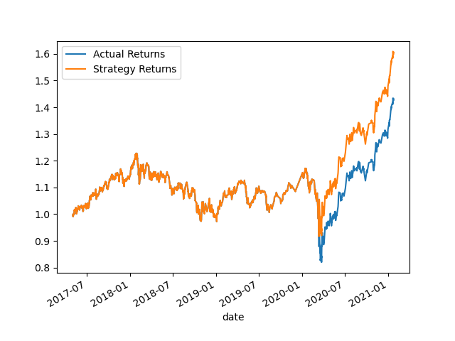
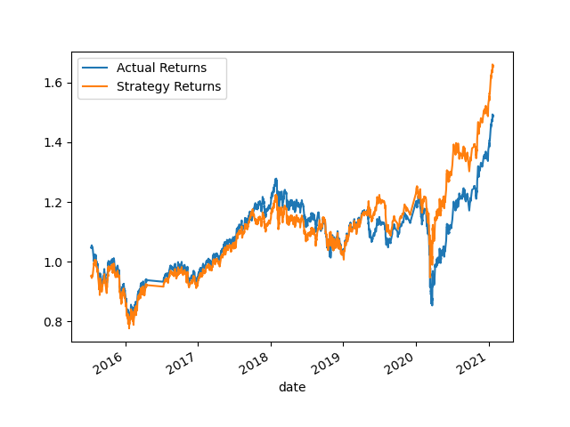
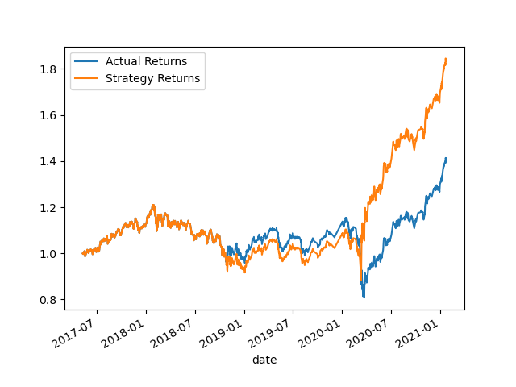
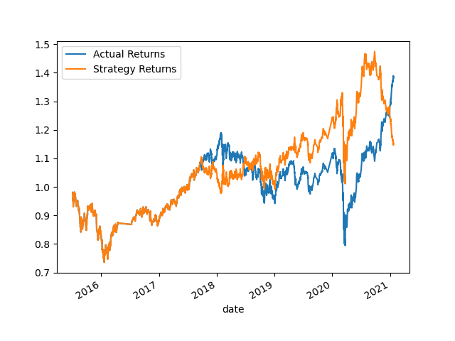

### Strategy 1 - Baseline

Model: SVC
SMA:
short_window = 4
long_window = 100

Train/Test:

Training Data: 3 Months: 2015-04-02 15:00:00 - 2015-07-02 15:00:00

Testing Data: 66 Months: 2015-07-06 10:00:00 - 2021-01-22 15:45:0

             precision    recall  f1-score   support

        -1.0       0.43      0.04      0.07      1804
         1.0       0.56      0.96      0.71      2288

    accuracy                           0.55      4092

### Strategy 2 - Train Adjustments

Model: SVC
SMA:
short_window = 4
long_window = 100

Train/Test:

Training Data: 25 Months: 2015-04-02 15:00:0 - 2017-05-02 15:00:00

Testing Data:  44 Months: 2017-05-03 10:45:00 - 2021-01-22 15:45:0

              precision    recall  f1-score   support

        -1.0       0.80      0.00      0.01      1196
         1.0       0.56      1.00      0.72      1527

    accuracy                           0.56      2723

**What impact resulted from increasing or decreasing the training window?

Cumulative returns increased from 1.5 to 1.6 as seen on cumulative return plots
Accuracy improved slightly to 0.56 from 0.55
Precision of predicting sell signals (-1) improved the most from 0.43 to 0.80
Recall decreased by -.04 for sell signals and increased by +.04 for buy signals (+1)

Conclusion: Adjusting the training duration did see improvements over baseline

### Strategy 3 - SMA Adjustments

Model: SVC
SMA:
short_window = 3
long_window = 120

Train/Test:

Training Data: 3 Months: 2015-04-02 15:00:00 - 2015-07-02 15:00:00

Testing Data: 66 Months: 2015-07-06 10:00:00 - 2021-01-22 15:45:0

              precision    recall  f1-score   support

        -1.0       0.42      0.06      0.11      1793
         1.0       0.56      0.93      0.70      2284

    accuracy                           0.55      4077

**What impact resulted from increasing or decreasing either or both of the SMA windows?

Cumulative returns increased even more from 1.5 to ~1.65 as seen on cumulative return plots
Accuracy stayed the same at 0.55
Precision scores stayed about the same with .42 for sell signals and .56 for buy signals (vs. .55 for baseline)
Recall scores increased .02 for sell signals and decreased .03 for buy signals
The increase in Recall scores for sell signals therefore had a big impact

Conclusion: Adjusting the SMA led to even more improvements over baseline versus train duration adjustments

### Strategy 4 - Train & SMA Adjustments

Model: SVC
SMA:
short_window = 3
long_window = 120

Train/Test:

Training Data: 25 Months: 2015-04-09 15:00:0 - 2017-05-09 15:00:00

Testing Data:  44 Months: 2017-05-09 10:45:00 - 2021-01-22 15:45:0

              precision    recall  f1-score   support

        -1.0       0.52      0.01      0.02      1188
         1.0       0.56      0.99      0.72      1515

    accuracy                           0.56      2703

Cumulative returns increased from 1.5 to 1.8 as seen on cumulative return plots
Accuracy improved slightly to 0.56 from 0.55
Precision scores increased by .09 for sell signals and stayed the same for buy signals
Recall scores decreased by .03 for sell signals and increased by .03 for buy signals

Conclusion: This set of parameters, adjusting both the train and SMA windowsa, produced the model that performed the best

### Strategy 5 - Logistic Regression Model

Model: SVC
SMA:
short_window = 4
long_window = 100

Train/Test:

Training Data: 3 Months: 2015-04-02 15:00:00 - 2015-07-02 15:00:00

Testing Data: 66 Months: 2015-07-06 10:00:00 - 2021-01-22 15:45:0

              precision    recall  f1-score   support

        -1.0       0.44      0.33      0.38      1804
         1.0       0.56      0.66      0.61      2288

    accuracy                           0.52      4092
    
Cumulative returns decreased from 1.5 to 1.15 as seen on cumulative return plots
Accuracy decreased to 0.52 from 0.55
Precision scores stayed about the same for sell and buy signals
Recall scores increased significantly by .29 for sell signals and decreased significantly by .30 for buy signals. 

Conclusion: Applying logistic regression with the original baseline params produced the worst performing model. 
